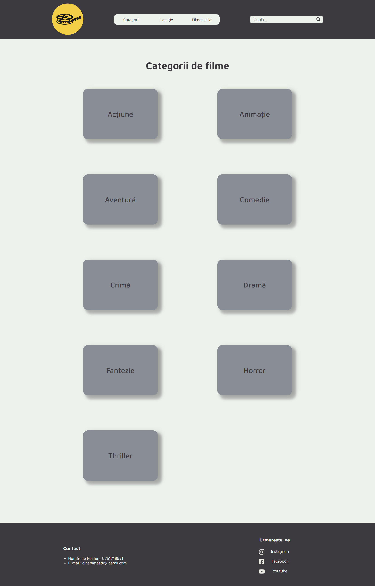

# Cinematastic

## Cuprins:

- [Descrierea proiectului](#Descrierea-proiectului)
- [Screenshots](#screenshots)
- [Tehnologii](#Tehnologii-folosite)
- [Instructiuni de instalare](#Instructiuni-de-utilizare)

## Descrierea proiectului
Acest proiect este un site web pentru un cinematograf. Utilizatorii au la dispoziție pe prima pagina filmele difuzate în ziua respectivă și harta cu locația cinematografului.\
Meniul dispune de trei butoane care facilitează navigarea prin aplicație și o bară de căutare. Utilizatorii își pot caută filmele preferate folosind numele acestora, dar și numele celui mai popular actor din film sau numele regizorului.\
Există și un buton care ghidează utilizatorii către pagina destinată categoriilor de film. Fiecare categorie de film are o pagină dedicată unde sunt prezentate toate filmele din categoria respectivă care pot fi difuzate în cinematorgraf. Fiecare film are o pagină dedicată unde se regasesc detalii despre film, un link către trailer, dar și o mică povestire a acestuia.

## Screenshots
### Pagina principala

### Pagina destinata categoriilor

### Pagina destinata filmelor de comedie

### Pagina destinata unui film


## Tehnologii folosite
Proiectul a fost creat folosind:
- Django
- JavaScrip
- SCSS
- HTML

## Instructiuni de utilizare
Se creează și se activează un virtual environment (pentru Windows)
```sh
#instalare venv
py -m pip install --user virtualenv

#creeare virtual environment
py -m venv env

#activare virtual environment
.\env\Scrips\activate
```
Instalarea pachetelor necesare folosirii proiectului
```sh
pip install -r requirements.txt
```
Pornirea server-ului
```sh
python manage.py runserver
```